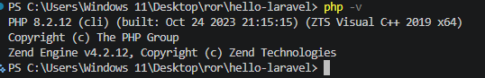
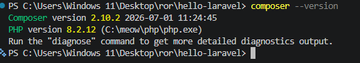
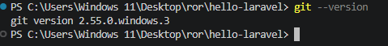
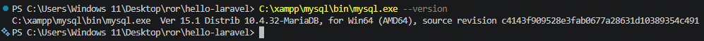
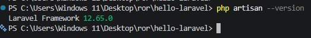
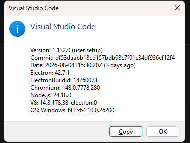
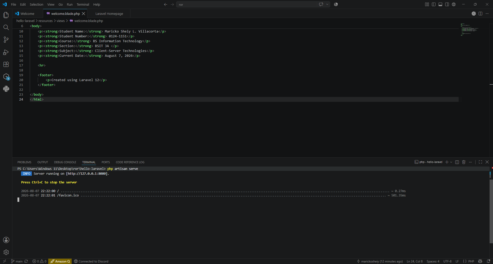
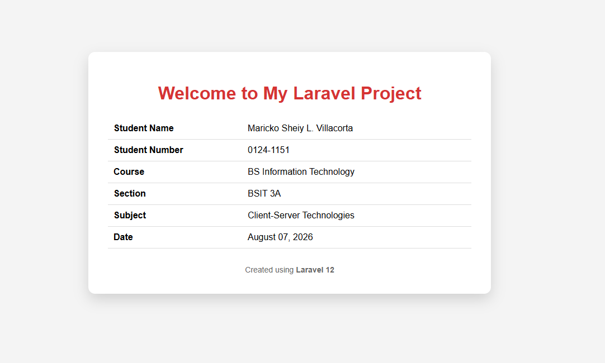

# Client-Server Week 02 - Laravel Setup

## Student Information

**Name:** Maricko Sheiy L. Villacorta  
**Student Number:** 0124-1151  
**Course:** BS Information Technology  
**Section:** BSIT 3A  
**Subject:** Client-Server Technologies  
**Date:** August 7, 2026  

---

# Laravel Development Environment Setup

This repository contains my Laravel Development Environment Setup activity for the Client-Server Technologies subject. The activity includes the verification of the required development tools, creation and configuration of a Laravel project, database migration, running the Laravel development server, customization of the homepage using Blade, and Git version control.

---

# Development Environment

| Software | Version |
|---|---|
| PHP |PHP 8.2.12 |
| Composer | Composer 2.10.2 |
| Laravel | Laravel Framework 12 |
| Git | Git 2.55.0 |
| MySQL/MariaDB | MariaDB 10.4.32 |
| Visual Studio Code | 1.132.0 |

---

# Installation Steps

## Step 1 — Verify PHP Installation

PHP was verified using PowerShell to confirm that PHP is installed and available through the command line.

Command:

```powershell
php -v
```



---

## Step 2 — Verify Composer Installation

Composer was verified to ensure that PHP dependencies and Laravel packages can be managed.

Command:

```powershell
composer --version
```




---


Git was verified to confirm that version control is available for the Laravel project.

Command:

```powershell
git --version
```



---


The MySQL/MariaDB installation was verified using the MySQL executable included with XAMPP.

Command:

```powershell
C:\xampp\mysql\bin\mysql.exe --version
```




---

## Step 5 — Verify Laravel Installation

The Laravel Framework version was verified from inside the Laravel project directory.

Command:

```powershell
php artisan --version
```

The project uses Laravel Framework 12.




---

## Step 6 — Verify Visual Studio Code

Visual Studio Code was used as the primary code editor for creating and modifying the Laravel project.

The Visual Studio Code version was checked through the application's About information.




---

## Step 7 — Create the Laravel Project

The Laravel project was created using Composer.

Command:

```powershell
composer create-project laravel/laravel hello-laravel
```

The project was created with the name `hello-laravel` and was opened in Visual Studio Code for development.

---

## Step 8 — Configure the Laravel Application

The Laravel application key was generated using Artisan.

Command:

```powershell
php artisan key:generate
```

This generates the application encryption key required by Laravel.

---

## Step 9 — Configure and Initialize the Database

The Laravel project uses SQLite as its database.

The database migrations were executed using:

```powershell
php artisan migrate
```

The migration command successfully checked the database. When there are no pending migrations, Laravel displays:

```text
INFO  Nothing to migrate.
```

---

## Step 10 — Run the Laravel Development Server

The Laravel development server was started using Artisan.

Command:

```powershell
php artisan serve
```

The application can then be accessed through:

```text
http://127.0.0.1:8000
```




---

## Step 11 — Customize the Laravel Homepage Using Blade

The default Laravel homepage was customized by editing the following Blade view:

```text
resources/views/welcome.blade.php
```

The homepage was modified to display the student's information, including the student's name, student number, course, section, subject, and date.




---

## Step 12 — Track the Project Using Git

Git was used to track the development of the Laravel project.

### Initialize the Git Repository

```powershell
git init
```

### Rename the Branch to Main

```powershell
git branch -M main
```

### Add the GitHub Remote Repository

```powershell
git remote add origin https://github.com/marickosheiy/client-server-week02-laravel-setup.git
```

### Stage the Project Files

```powershell
git add .
```

### Commit the Project

```powershell
git commit -m "Initial Laravel setup"
```

### Push the Project to GitHub

```powershell
git push -u origin main
```

The Laravel project was successfully connected to GitHub and pushed to the `main` branch.

---

# Git Commit History

The Git repository contains commits documenting the development and completion of the Laravel project.

To view the commit history:

```powershell
git log --oneline
```

---

# Project Structure

The Laravel project follows the standard Laravel directory structure.

```text
hello-laravel/
├── app/
├── bootstrap/
├── config/
├── database/
├── public/
├── resources/
│   └── views/
│       └── welcome.blade.php
├── routes/
├── storage/
├── tests/
├── screenshots/
├── .env
├── .env.example
├── artisan
├── composer.json
├── composer.lock
├── package.json
└── README.md
```

---

# Screenshots

The following screenshots provide evidence of the development environment and completed Laravel application:

1. PHP Version

2. Composer Version

3. Git Version

4. MySQL/MariaDB Version

5. Laravel Version

6. Visual Studio Code

7. Laravel Development Server

8. Customized Laravel Homepage


---

# Reflection

This activity helped me understand the process of setting up a Laravel development environment and the different tools required for client-server web development. I learned how PHP, Composer, Laravel, Git, MySQL/MariaDB, and Visual Studio Code work together when developing a Laravel application.

I also learned how to create and configure a Laravel project, perform database migrations, run the Laravel development server, and customize a webpage using a Blade view.

Lastly, I gained experience using Git and GitHub to track and manage my project files and development history.

---
## References
Laravel. (n.d.). Laravel documentation. https://laravel.com/docs/13.x

Composer. (n.d.). Composer documentation. https://getcomposer.org/doc/

Git. (n.d.). Git documentation. https://git-scm.com/docs/git

PHP Documentation Group. (n.d.). PHP documentation. https://www.php.net/manual/en/

Visual Studio Code. (n.d.). Visual Studio Code documentation. https://code.visualstudio.com/docs/getstarted/overview


##  Repository

The completed Laravel project is hosted on GitHub:

(https://github.com/marickosheiy/client-server-week02-laravel-setup)

The repository contains the Laravel project source code, documentation, installation screenshots, customized Blade homepage, and Git commit history.

### Final Verification

The following were successfully verified:

- Laravel project runs successfully using `php artisan serve`.
- Customized homepage displays correctly at `http://127.0.0.1:8000`.
- PHP, Composer, Laravel, Git, MySQL/MariaDB, and Visual Studio Code versions were verified.
- Database migration was successfully executed using `php artisan migrate`.
- All required screenshots are included in the `screenshots/` directory.
- The customized homepage was created using the Blade view `resources/views/welcome.blade.php`.
- Project documentation is complete in `README.md`.
- Git working tree is clean and the `main` branch is synchronized with the GitHub repository.